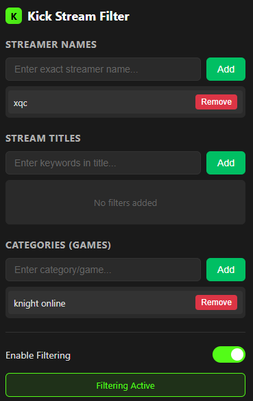

# 🎮 FilteredKick - Chrome Extension for Kick.com

<div align="center">
  
  
  
  
  
  **🚀 Take control of your Kick.com browsing experience!**
  
  Filter out unwanted streams by streamer name, title keywords, or game categories.
  
</div>

---

## ✨ Features

### 🎯 Smart Filtering System
- **👤 Streamer Names** - Exact match filtering (case-insensitive)
  - ✅ "Drake" filters streamer "Drake"
  - ✅ "drake" also filters streamer "Drake" 
  - ❌ "drak" will NOT filter streamer "Drake"
  
- **📝 Stream Titles** - Partial keyword matching
  - Example: Filter "knight" blocks all streams with "knight" in the title
  
- **🎮 Categories/Games** - Partial category matching
  - Example: Filter "fortnite" hides all Fortnite streams

### 🔧 Additional Features
- **💚 Toggle On/Off** - Instantly enable/disable all filters
- **💾 Backup System** - Export and import your filter configurations
- **🔄 Real-time Updates** - Filters apply automatically as you browse
- **💪 Persistent Storage** - Your filters are saved between sessions

---

## 📦 Installation

### Step 1: Download the Extension
```bash
git clone https://github.com/tugayigus/FilteredKick.git
```
Or download as ZIP from the [releases page](https://github.com/tugayigus/FilteredKick/releases)

### Step 2: Load in Chrome
1. Open Chrome and navigate to `chrome://extensions/`
2. Enable **Developer mode** (toggle in top right)
3. Click **Load unpacked**
4. Select the FilteredKick folder

### Step 3: Start Filtering! 
1. Go to [kick.com](https://kick.com)
2. Click the FilteredKick icon in your toolbar
3. Add your filters and enjoy a cleaner browsing experience! 🎉

---

## 🎯 How to Use

### Adding Filters
| Filter Type | How to Add | Example |
|------------|------------|---------|
| **Streamer** | Enter exact username | `xQc`, `Trainwreckstv` |
| **Title** | Enter keywords | `drops`, `giveaway`, `24 hour` |
| **Category** | Enter game/category | `slots`, `just chatting` |

### Managing Filters
- **➕ Add** - Type and click "Add" or press Enter
- **🗑️ Remove** - Click "Remove" next to any filter
- **💾 Export** - Save all filters to a JSON file
- **📂 Import** - Load filters from a backup (merge or replace)

---

## 📸 Screenshot

<div align="center">
  
  
  *Clean and intuitive filter management interface*
</div>

---

## 🛠️ Technical Details

### File Structure
```
FilteredKick/
├── manifest.json       # Extension configuration
├── popup.html         # UI for filter management
├── popup.js          # Popup functionality
├── content.js        # Content script for filtering
├── icon-16.png      # Toolbar icon (16x16)
├── icon-48.png      # Extension icon (48x48)
└── icon-128.png     # Store icon (128x128)
```

### How It Works
1. **Content Script** runs on all kick.com pages
2. **Searches** for stream cards with class `group/card`
3. **Extracts** streamer name, title, and category
4. **Compares** against user filters
5. **Hides** matching streams instantly

### Filter Matching Logic
- **Streamer Names**: Exact match only (case-insensitive) ⚡ NEW!
- **Titles & Categories**: Partial match (case-insensitive)
- **Performance**: Optimized with MutationObserver for dynamic content

---

## 💾 Backup & Restore

### Export Your Filters
1. Click **💾 Export** button
2. Save the JSON file (auto-named with date)
3. Keep it safe for backup or sharing

### Import Filters
1. Click **📂 Import** button
2. Select your backup JSON file
3. Choose:
   - **Replace** - Start fresh with imported filters
   - **Merge** - Combine with existing filters

---

## 🤝 Contributing

Found a bug? Have a feature request? 

1. Fork the repository
2. Create your feature branch (`git checkout -b feature/AmazingFeature`)
3. Commit your changes (`git commit -m 'Add some AmazingFeature'`)
4. Push to the branch (`git push origin feature/AmazingFeature`)
5. Open a Pull Request

---

## 📝 Recent Updates

### v1.1.0 - Latest Update
- 🎯 **Streamer filtering changed to exact match** - More precise control
- 💾 Added import/export backup system
- 🎨 Updated UI with Kick.com's green theme
- 🐛 Various bug fixes and performance improvements

### v1.0.0 - Initial Release
- ✅ Basic filtering by streamer, title, and category
- ✅ Persistent storage
- ✅ Real-time filtering

---

## ⚠️ Disclaimer

This extension is not affiliated with, endorsed by, or sponsored by Kick.com. It's an independent tool created to enhance user experience.

---

## 📄 License

This project is open source and available under the [MIT License](LICENSE).

---

<div align="center">
  
  ### 🌟 If you find this useful, please star the repository! 🌟
  
  Made for Kick Community by [tugayigus](https://github.com/tugayigus)
  
</div>